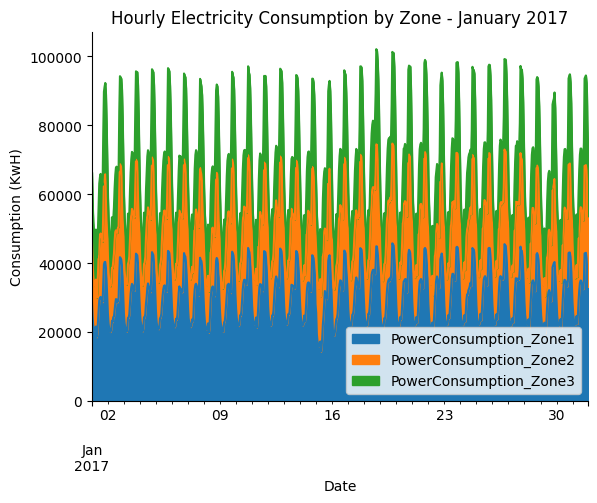
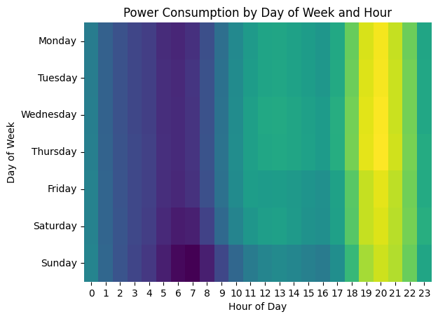

# Morocco's National Power Co. Electricity Consumption Analysis

## Overview

This portfolio project examines seasonal patterns in electricity consumption for Morocco's National Power Co. The goal is to identify peak load periods by hour and day, which can inform strategic investments to prevent outages during critical times.

## Table of Contents

- [Morocco's National Power Co. Electricity Consumption Analysis](#moroccos-national-power-co-electricity-consumption-analysis)
  - [Overview](#overview)
  - [Table of Contents](#table-of-contents)
  - [Introduction](#introduction)
  - [Problem Statement](#problem-statement)
  - [Data Overview](#data-overview)
  - [Data Preparation](#data-preparation)
  - [Exploratory Analysis](#exploratory-analysis)
    - [Hourly Consumption Trends](#hourly-consumption-trends)
    - [Seasonality and Heatmap Visualization](#seasonality-and-heatmap-visualization)
  - [Conclusions](#conclusions)
  - [Acknowledgments](#acknowledgments)

## Introduction

Electricity consumption patterns can vary greatly over different hours and days. Understanding these seasonal patterns is crucial for managing grid reliability and making informed decisions regarding capacity investments. This project utilizes hourly consumption data across three power zones to reveal key trends and help Morocco's National Power Co. preemptively address periods of high demand.

## Problem Statement

The project aims to:

- **Analyze seasonal patterns** in electricity consumption.
- **Identify peak load periods** by hour and day.
- **Inform strategic investments** that prevent outages during periods of high consumption.

## Data Overview

The analysis uses a CSV dataset containing the following key columns:

- **Datetime:** Timestamp for each reading.
- **PowerConsumption_Zone1:** Consumption values for Zone 1.
- **PowerConsumption_Zone2:** Consumption values for Zone 2.
- **PowerConsumption_Zone3:** Consumption values for Zone 3.

Additional features, such as total consumption, hour of day, and day of week, are derived from the raw data.

## Data Preparation

The following steps outline how the data was prepared for analysis:

1. **Imports and Reading the CSV File**

```python
import pandas as pd
import seaborn as sns

consumption = pd.read_csv(
    '/path/to/data/powerconsumption.csv',
    usecols=['Datetime', 'PowerConsumption_Zone1', 'PowerConsumption_Zone2', 'PowerConsumption_Zone3'],
    parse_dates=['Datetime']
)
consumption.head()
```

2. **Creating Additional Columns**
    - Total Consumption: Sum of consumption across all three zones.
    - Hour: Extracted from the Datetime column.
    - Day of Week: Extracted as a numeric value (Monday = 0, Sunday = 6).

```python
# Calculate total consumption
consumption['Total_Consumption'] = (
    consumption['PowerConsumption_Zone1'] +
    consumption['PowerConsumption_Zone2'] +
    consumption['PowerConsumption_Zone3']
)

# Extract hour and day of week from Datetime
consumption['Hour'] = consumption['Datetime'].dt.hour
consumption['Day_Of_Week'] = consumption['Datetime'].dt.day_of_week

consumption.head()
```

## Exploratory Analysis

### Hourly Consumption Trends

The dataset was resampled to an hourly frequency to visualize trends across different zones for January 2017. This area chart reveals how consumption varies over the course of a day.



### Seasonality and Heatmap Visualization

A heatmap was created to visualize average total consumption by day of the week and hour of the day. This visualization helps to quickly identify peak load periods.



## Conclusions

The analysis reveals clear seasonal trends:

- Hourly Patterns: Consumption fluctuates significantly over the day, with identifiable peak periods.
- Daily Patterns: Specific days show higher average consumption, suggesting targeted times for investment in capacity or demand management.

These insights can guide Morocco’s National Power Co. in optimizing grid reliability and planning preventive measures for high-demand periods.

## Acknowledgments

This project was completed as part of a guided learning experience with **Maven Analytics**. Special thanks to Maven Analytics for providing structured guidance and high-quality datasets to enhance analytical skills. 